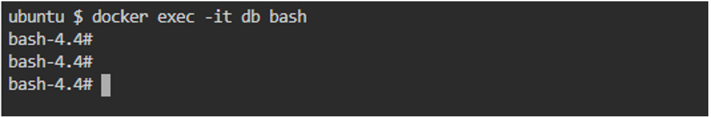
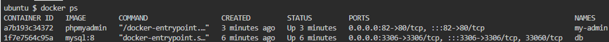
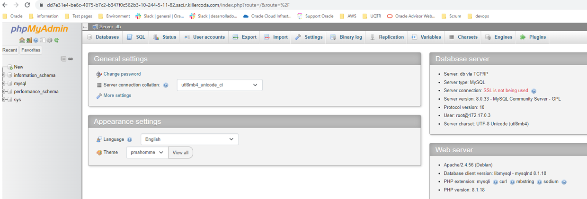

```
docker logs db
```
<p align="center"></p>

```
docker exec -it db bash
```
<p align="center"></p>

```
mysql -u root -p
```
<p align="center"></p>

```
docker ps
```
<p align="center"></p>

```
http://localhost:82/
```
<p align="center"></p>
