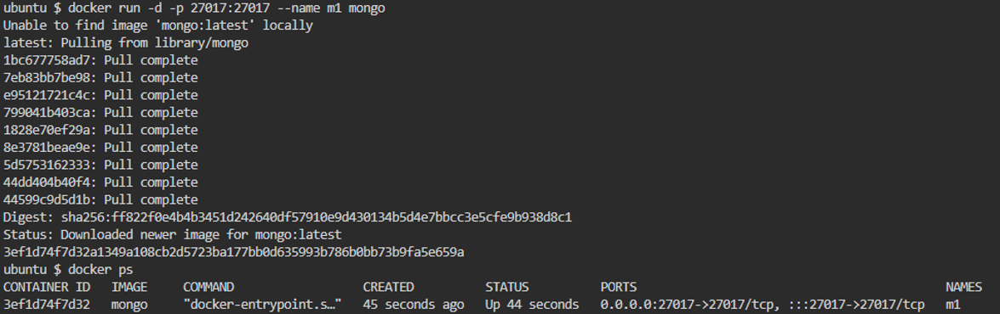
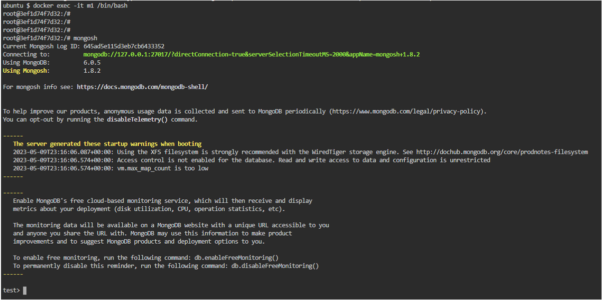
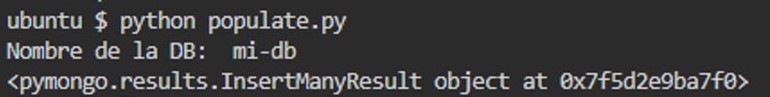
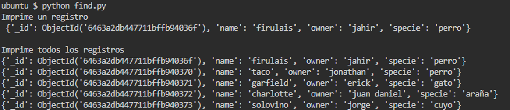
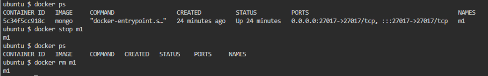

```
docker run -d -p 27017:27017 --name m1 mongo
docker ps
```
<p align="center"></p>

```
docker exec -it m1 /bin/bash
mongosh
```
<p align="center"></p>

```
python populate.py
```
<p align="center"></p>

```
python find.py
```
<p align="center"></p>

```
docker stop m1
docker rm m1
```
<p align="center"></p>
