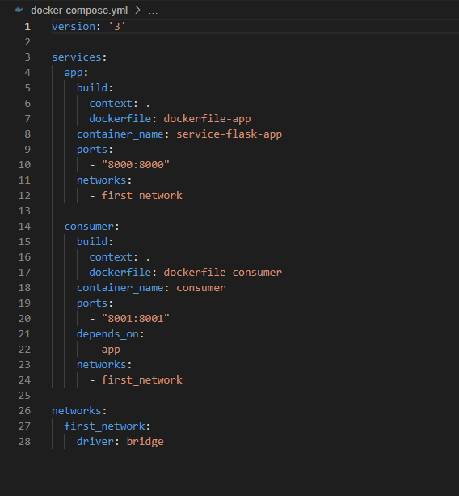
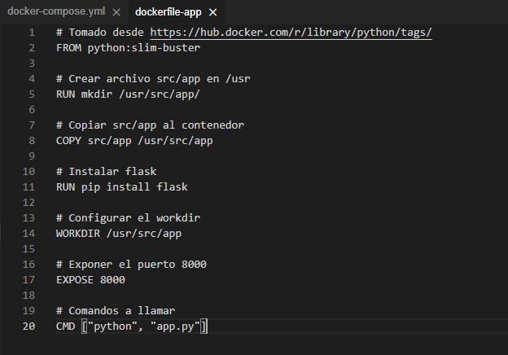
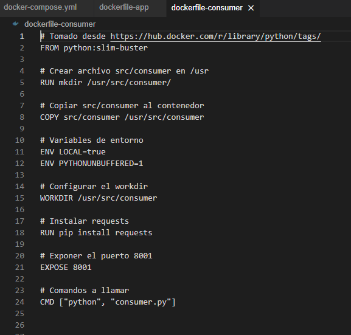
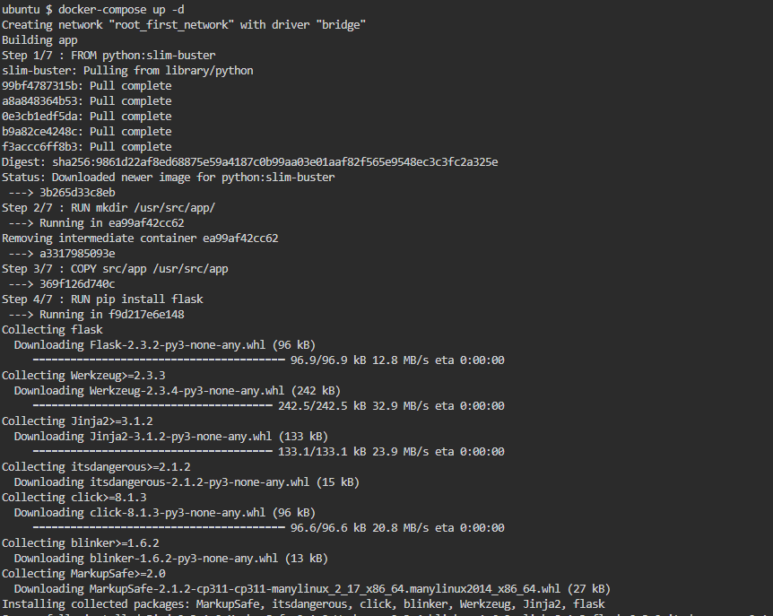
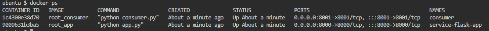
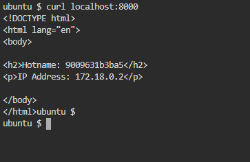
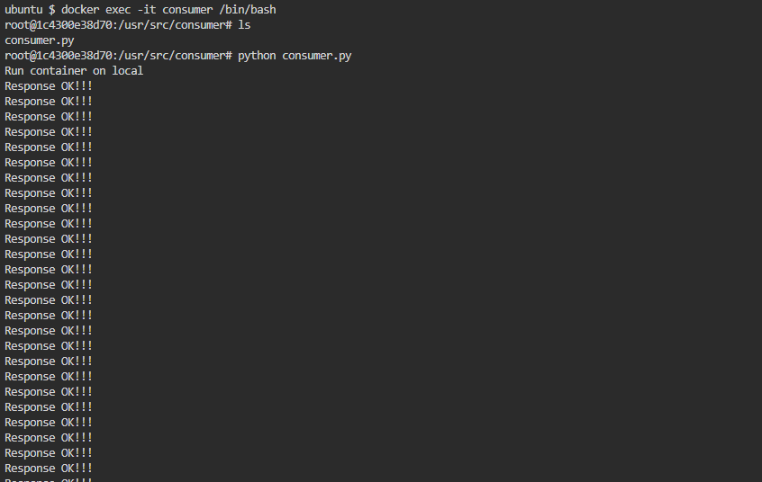

```
docker-compose up -d
```

<p align="center"></p>

<p align="center"></p>

<p align="center"></p>

<p align="center"></p>

```
docker ps
```

<p align="center"></p>

```
curl localhost:8000
```

<p align="center"></p>

```
docker exec -it consumer /bin/bash
ls
python consumer.py
```

<p align="center"></p>
