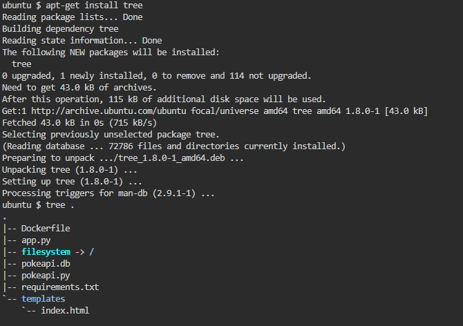
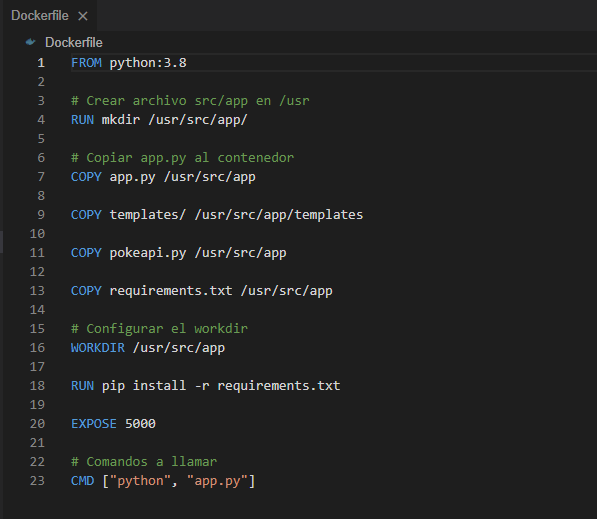
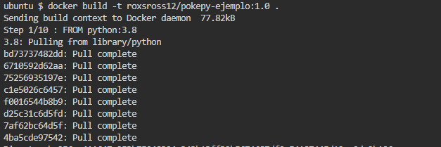
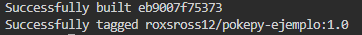
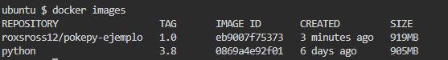
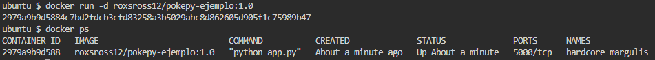
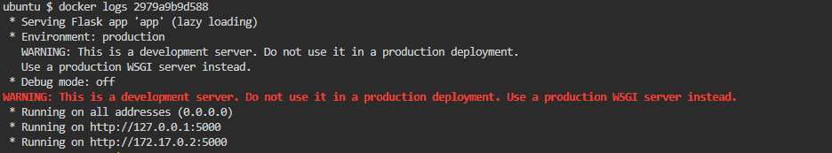
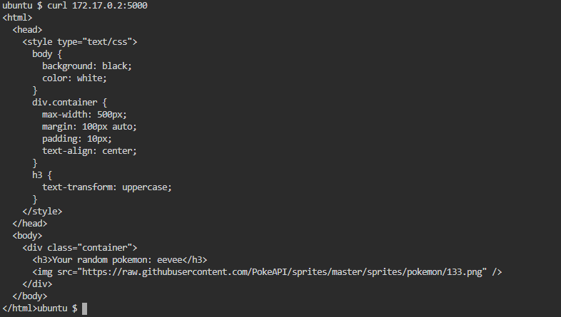

```
apt-get install tree
tree .
```
<p align="center"></p>

# Dockerfile

<p align="center"></p>

# Construir la imagen

```
docker build -t roxsross12/pokepy-ejemplo:1.0 .
```

<p align="center"></p>

<p align="center"></p>

# Verificar la creacion de la imagen

```
docker images
```

<p align="center"></p>

# Correr el contenedor con la imagen creada

```
docker run -d roxsross12/pokepy-ejemplo:1.0

docker ps

```

<p align="center"></p>

# Verificar logs para buscar ip publica utilizada

```
docker logs 2979a9b9d588
```

<p align="center"></p>

# Hacer curl de verificacion de la aplicacion

```
curl 172.17.0.2:5000
```

<p align="center"></p>
