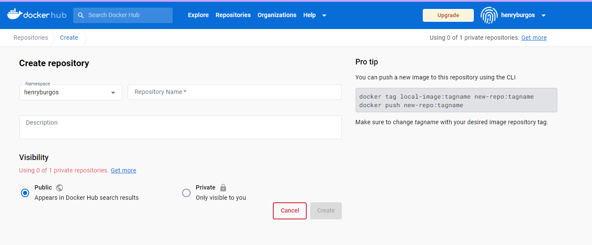
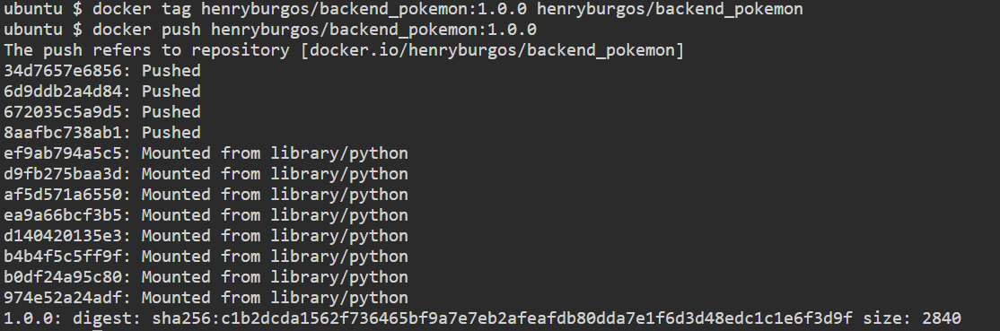

# Documentación del Lab-07
---

## 1. Dockerfile Frontend y Backend
---

### Backend:

Procedemos a crear el archivo Dockerfile dentro de la carpeta backend-pokemon-app

```
cd backend-pokemon-app
nano Dockerfile
```
Dentro del Dockerfile escribir lo siguiente
```
# Usa la imagen base de Python 3.8
FROM python:3.8

# Establece el directorio de trabajo dentro del contenedor
WORKDIR /app

# Copia el archivo de requisitos al directorio de trabajo
COPY requirements.txt .

# Instala las dependencias del proyecto
RUN pip install --no-cache-dir -r requirements.txt

# Copia el código fuente del proyecto al directorio de trabajo
COPY . .

# Expone el puerto si tu aplicación lo requiere
EXPOSE 8000

# Comando por defecto para ejecutar la aplicación
CMD [ "python", "main.py" ]

```
Guardar cambios 


Construimos la imagen

```
docker build -t backend_pokemon:1.0.0 .
```


Ejecutamos la siguiente comando para levantar un contenedor:

```
docker run -d -p 8000:8000 backend_pokemon:1.0.0
```
Para visualizar el contenedor creado:

```
docker ps
```


### Frontend:

Procedemos a crear el archivo Dockerfile dentro de la carpeta backend-pokemon-app

```
cd frontend-pokemon-app
nano Dockerfile
```
Dentro del Dockerfile escribir lo siguiente

```
# Usa la imagen base de Node.js 16
FROM node:16

# Establece el directorio de trabajo dentro del contenedor
WORKDIR /app

# Copia los archivos de package.json y package-lock.json
COPY package*.json ./

# Instala las dependencias del proyecto
RUN npm install

# Copia el código fuente de la aplicación al directorio de trabajo
COPY . .

# Compila la aplicación de React para producción
RUN npm run build

# Expone el puerto en el que se ejecuta la aplicación (normalmente 3000)
EXPOSE 3000

# Comando por defecto para ejecutar la aplicación
CMD [ "npm", "start" ]

```
Guardar cambios 


Construimos la imagen

```
docker build -t frontend_pokemon:1.0.0 .
```


Ejecutamos la siguiente comando para levantar un contenedor:

```
docker run -d -p 3000:3000 frontend_pokemon:1.0.0
```
Para visualizar el contenedor creado:

```
docker ps
```


## 2. Subir la Imagen del Frontend y Backend al Registry Docker Hub con versionado
---

Creamos nuestras credenciales en DockerHub y accedemos al portal luego procedemos a crear 2 repositorios con visibilidad pública con nombre backend_pokemon y frontend_pokemon




### Backend:

Iniciamos con el proceso de subir  backend_pokemon  ingresamos a la carpeta backend-pokemon-app con el comando

```
cd backend-pokemon-app
```
una vez dentro de la carpeta procedemos a loguearnos a Docker Hub

```
docker login -u usuario_docker_hub
```
construimos la imagen

```
docker build -t henryburgos/backend_pokemon:1.0.0 .
docker images
docker tag henryburgos/backend_pokemon:1.0.0 henryburgos/backend_pokemon
docker push henryburgos/backend_pokemon:1.0.0

```





### Frontend:

Iniciamos con el proceso de subir  frontend_pokemon  ingresamos a la carpeta frontend-pokemon-app con el comando

```
cd frontend-pokemon-app
```
una vez dentro de la carpeta procedemos a loguearnos a Docker Hub

```
docker login -u usuario_docker_hub
```
construimos la imagen

```
docker build -t henryburgos/frontend_pokemon:1.0.0 .
docker images
docker tag henryburgos/frontend_pokemon:1.0.0 henryburgos/frontend_pokemon
docker push henryburgos/frontend_pokemon:1.0.0

```


## 3. Docker-compose
---

```
version: '3'

services:
  backend:
    image: backend_pokemon:1.0.0
    ports:
      - 8000:8000

  frontend:
    image: frontend_pokemon:1.0.0
    ports:
      - 3000:3000

```

