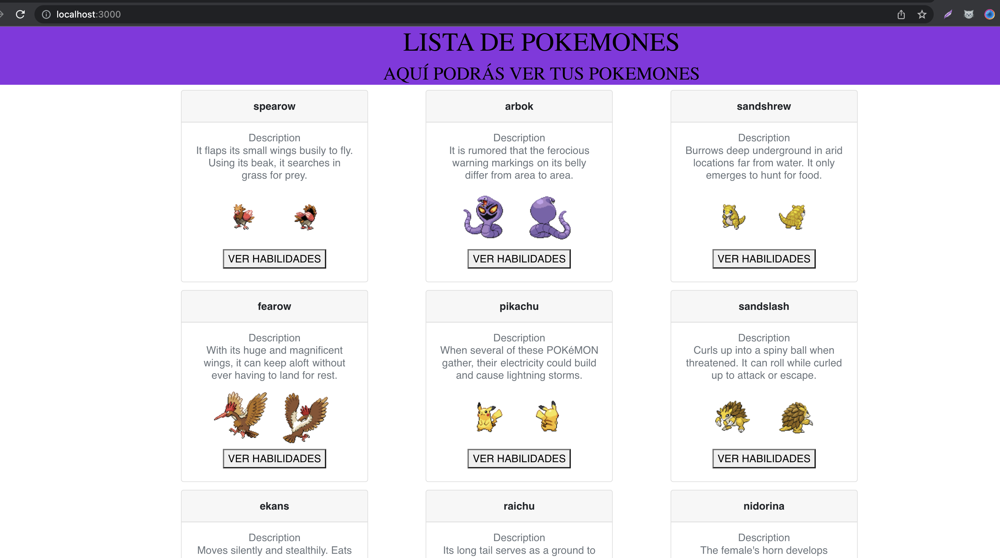

# Documentación del Lab-07
---

## Dockerfile Frontend y Backend
### Backend:
```
cd backend-pokemon-app
docker build -t backend_pokemon:1.0.0 .

```


### Frontend:

## Subir la Imagen del Frontend y Backend al Registry Docker Hub con versionado

## Docker-compose

