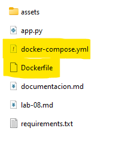
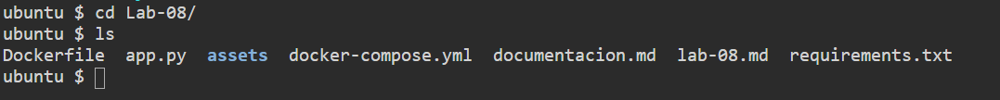
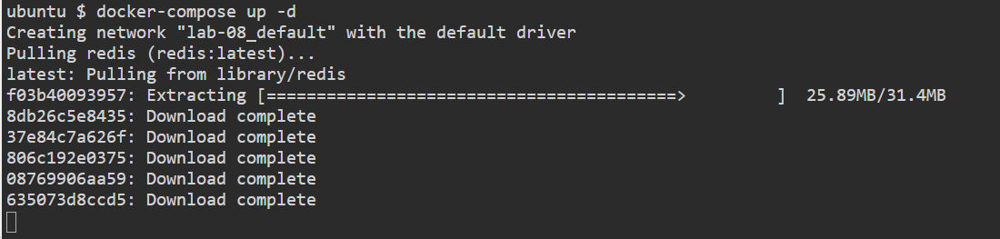
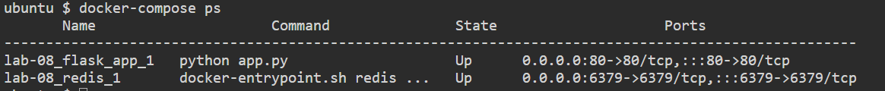
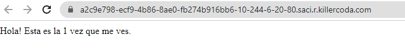

# Documentación del Lab-08 
---
#### 1.- Realización del Dockerfile 
Procedemos a crear un archivo de texto y guardamos con el nombre de Dockerfile (sin extensión) y procedemos a escribir de acuerdo a la siguiente imagen:

luego de ingresar las lineas de código procedemos a guardar.

### 2.- Realización del docker-compose.yml 
Procedemos a crear un archivo de texto y guardamos con el nombre de docker-compose.yml  y procedemos a escribir de acuerdo a la siguiente imagen:

luego de ingresar las lineas de código procedemos a guardar.

### 3.- Ejecución de Dockerfile
Antes de proceder a la ejecución del archivo Dockerfile debemos validar que los archivos Dockerfile y docker-compose.yml se encuentren copiados dentro de la ubicación del archivo app.py 

accedemos a la ubicación donde se encuentre el archivo docker-compose.yml  podemos validar ejecutando el comando ls

luego procedemos a ejecucar con el siguiente comando:

docker-compose up -d

### 4.- Realizar las validaciones
Ejecutamos en el terminar el siguiente comando para validar la creación de los docker:
docker-compose ps

Finalmente abrimos un navegador y escribimos en el browser http://localhost  y observamos el siguiente resultado.

