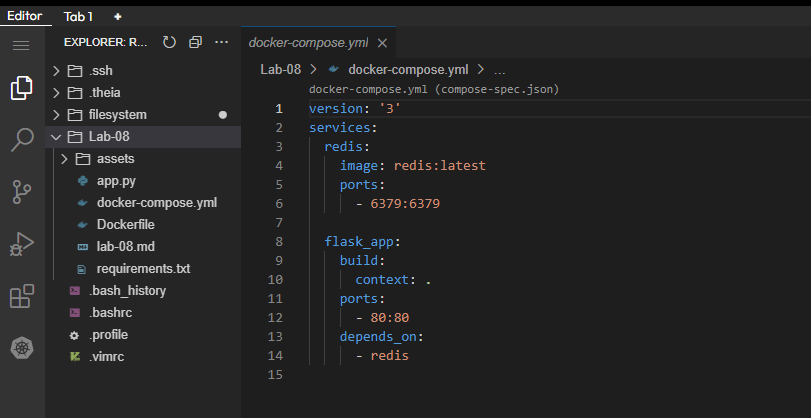
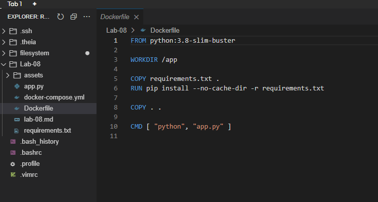

# Documentación del Lab-08 
---
#### 1.- Realización del Dockerfile 

La empresa ZERO Technology, solicita al Equipo de DevOps Trainer, la contenerizacion de su aplicacion "Python"

### 2.- Realización del docker-compose.yml 

- Se debe Armar un Docker-Compose 
- Se recomienda revisar el app.py como será la comunicacion con la redis.
- Documentación

