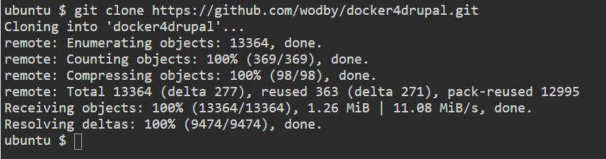
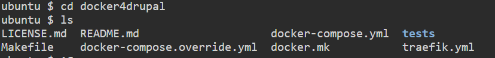
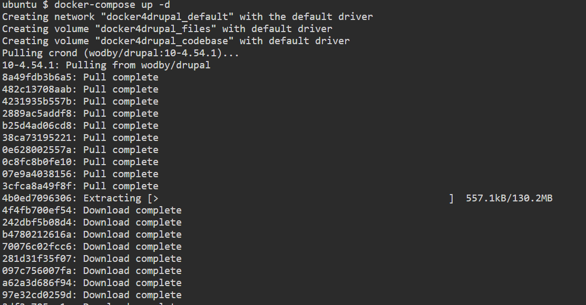
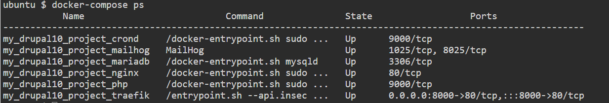

# Documentación del Lab-09 
---
#### 1.- Descargando archivos fuentes desde repositoria hacia el servidor linux
Procedemos a ejecutar el siguiente comando git desde la raiz del servidor:

#### 2.-Ejecución del archivo Dockerfile
Ingresamos a la carpeta docker4drupal utilizando el comando "cd docker4drupal" luego para validar el contenido y validar la existencia del archivo docker-compose.yml utilizamos comando ls para visualizar

Dentro de la carpeta donde se ubica el docker-compose.yml ejecutamos el comando "docker-compose up -d"

Validamos la creación de los docker ejecutamos el comando "docker-compose ps" mostrando el siguiente resultado:

