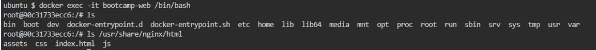

```
docker run -d --name bootcamp-web -v /root/web:/usr/share/nginx/html -p 9999:80 nginx:latest
```
<p align="center"></p>

```
docker exec -it bootcamp-web /bin/bash
ls
ls /usr/share/nginx/html
```
<p align="center"></p>

<p align="center"></p>
