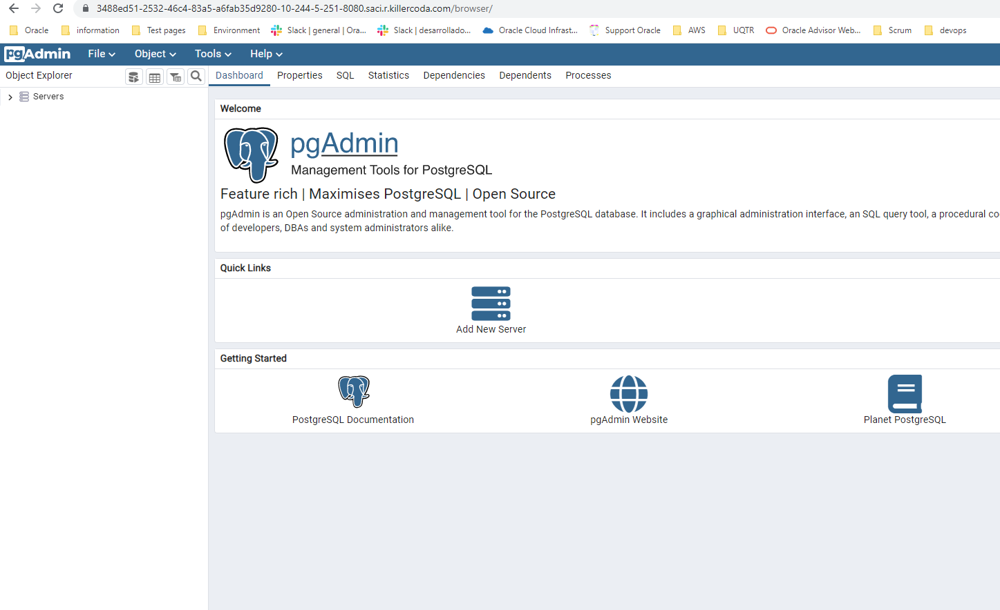

# Archivo docker-compose.yml

<p align="center"></p>

# Crear carpeta data para tener el volumen de la BD postgres localmente 
```
mkdir data
```

# Crear la imagen por medio del docker-compose.yml

```
docker-compose up -d --build
```

<p align="center"></p>


# Verificamos que el contenedor postgres este corriendo
```
docker ps

```

<p align="center"></p>

# Verificamos pgadmin in puerto 8080
Entramos con admin y clave configurada en el archivo docker-compose.yml 

<p align="center"></p>

