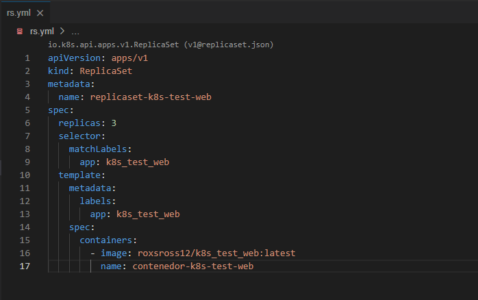
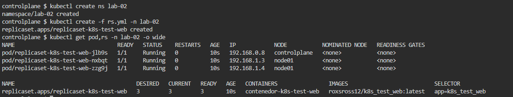
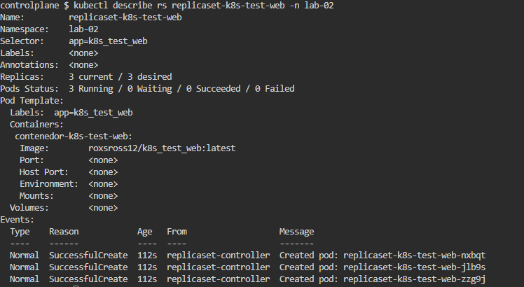
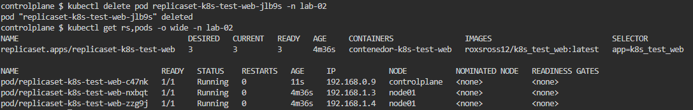
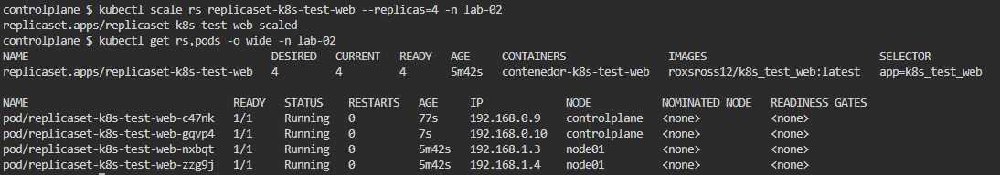

# Archivo rs.yml

<p align="center"></p>

# ReplicaSet creado y 3 Pods en NameSpace lab-2

```
kubectl create ns lab-02
kubectl create -f rs.yml -n lab-02
kubectl get pod,rs -n lab-02 -o wide
```

<p align="center"></p>

# Informacion detallada del ReplicaSet en NameSpace lab-02

```
kubectl describe rs replicaset-k8s-test-web -n lab-02
```

<p align="center"></p>

# Pod creado despues de eliminar uno en NameSpace lab-02

```
kubectl delete pod replicaset-k8s-test-web-jlb9s -n lab-02
kubectl get rs,pods -o wide -n lab-02
```

<p align="center"></p>

# Pod creado despues del escalado en NameSpace lab-02

```
kubectl scale rs replicaset-k8s-test-web --replicas=4 -n lab-02
kubectl get rs,pods -o wide -n lab-02
```

<p align="center"></p>
