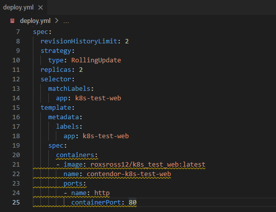
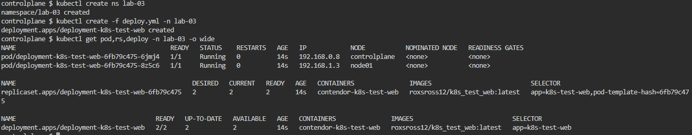
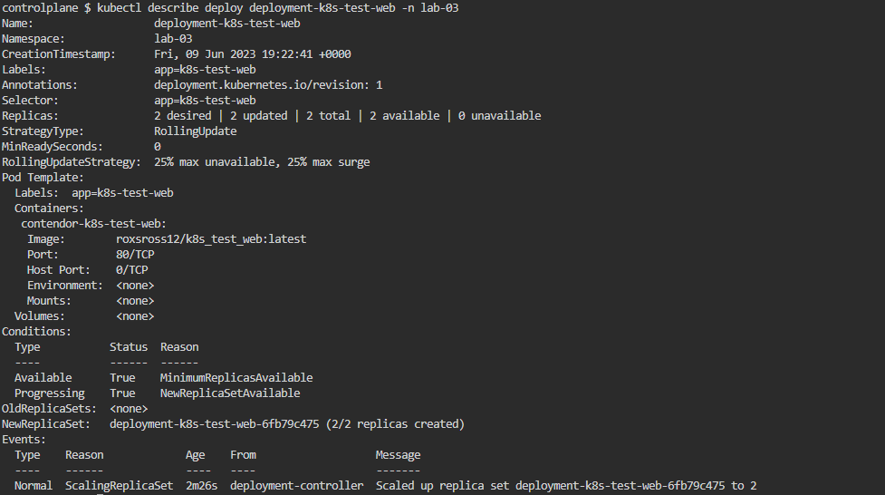
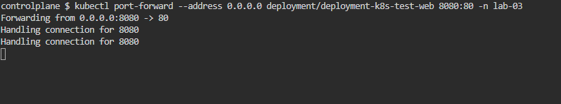
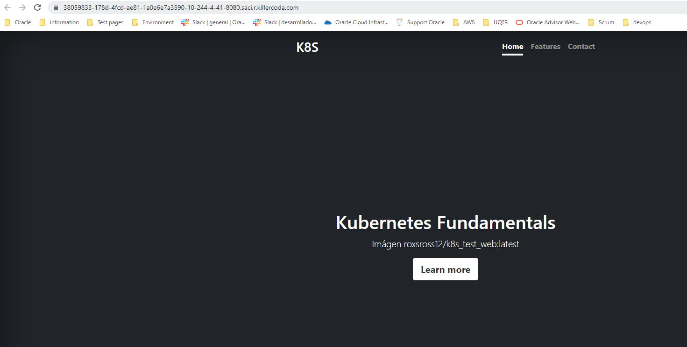
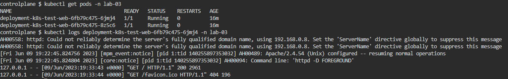

# Archivo deploy.yml

<p align="center"></p>

# Deployment creado en NameSpace lab-3

```
kubectl create ns lab-03
kubectl create -f deploy.yml -n lab-03
kubectl get pod,rs,deploy -n lab-03 -o wide
```

<p align="center"></p>

# Informacion detallada del Deployment en NameSpace lab-03

```
kubectl describe deploy deployment-k8s-test-web -n lab-03
```

<p align="center"></p>

# Deployment de la aplicacion por medio de port-forward puerto 8080 en NameSpace lab-03

```
kubectl port-forward --address 0.0.0.0 pod/deployment-k8s-test-web 8080:80 -n lab-03
```

<p align="center"></p>

<p align="center"></p>

# Logs de accesos en NameSpace lab-03

```
kubectl get pods -n lab-03
kubectl logs deployment-k8s-test-web-6fb79c475-6jmj4 -n lab-03
```
<p align="center"></p>